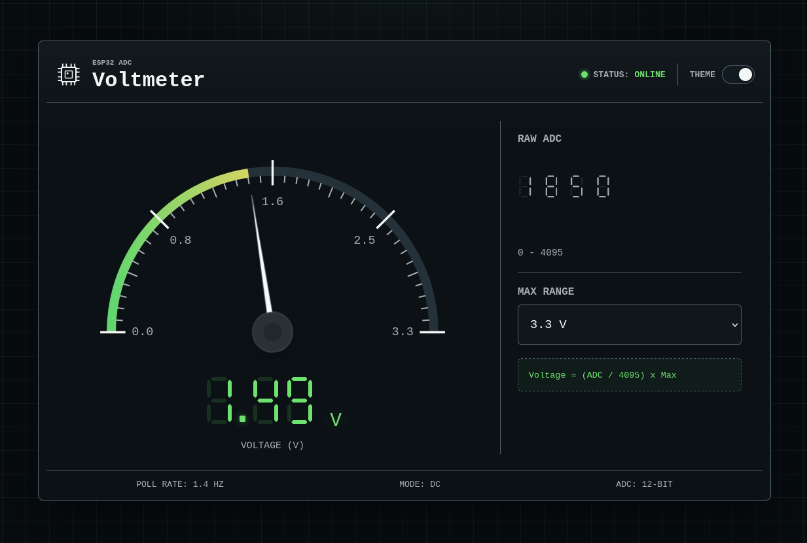

# ESP32 Web Voltmeter

A browser-based voltmeter for ESP32 boards. The ESP32 reads an analog voltage from its ADC, hosts a web page over Wi-Fi, and displays the measured value as a responsive gauge with a moving needle.

The web interface is served directly from the ESP32 program memory, so no SPIFFS, LittleFS, external server, or frontend build step is required.

## Overview



Features:

- Real-time voltage display using an animated gauge.
- Raw ADC value display.
- Configurable visual range: `3.3 V`, `5 V`, `12 V`, or custom.
- Light and dark mode toggle with browser preference storage.
- Self-contained ESP32 web server.
- Modular web assets split into HTML, CSS, and JavaScript headers.

## Project Structure

```text
VoltmeterESP32/
├── VoltmeterESP32.ino
├── index_html.h
├── style_css.h
├── script_js.h
├── assets/
│   └── web-preview.png
├── .gitignore
└── README.md
```

Files:

- `VoltmeterESP32.ino`: main Arduino sketch, Wi-Fi setup, ADC reading, and HTTP routes.
- `index_html.h`: embedded HTML served at `/`.
- `style_css.h`: embedded CSS served at `/style.css`.
- `script_js.h`: embedded JavaScript served at `/script.js`.
- `assets/web-preview.png`: optional screenshot used in the Overview section.

## Hardware Requirements

- ESP32 development board.
- USB cable for programming and power.
- Analog voltage source to measure.
- Jumper wires.
- Optional: potentiometer for testing.
- Required for voltages above `3.3 V`: external voltage divider or signal conditioning circuit.

## ADC Pin

The default ADC input pin is:

```cpp
const int ADC_PIN = 34;
```

`GPIO34` is input-only and commonly used as an ADC pin on ESP32 boards, which makes it a good default for this project.

The ADC configuration uses:

```cpp
analogReadResolution(12);
analogSetPinAttenuation(ADC_PIN, ADC_11db);
```

The sketch converts the raw ADC reading with:

```cpp
const float ADC_REFERENCE_VOLTAGE = 3.3;
const int ADC_MAX_READING = 4095;
```

If you use another ADC pin or a different calibration strategy, update these constants in `VoltmeterESP32.ino`.

## Wiring

Basic wiring:

```text
Signal to measure  -> GPIO34
Circuit ground     -> GND
```

Important safety note:

Do not connect more than `3.3 V` directly to an ESP32 ADC pin. If the voltage you want to measure is higher than `3.3 V`, use a voltage divider or another signal conditioning circuit before connecting it to the ESP32.

Example voltage divider for higher voltages:

```text
Measured voltage -> R1 -> ADC pin -> R2 -> GND
```

Choose resistor values so the ADC pin never receives more than `3.3 V`.

## Wi-Fi Configuration

Open `VoltmeterESP32.ino` and edit these constants:

```cpp
const char* WIFI_SSID = "YOUR_WIFI_NAME";
const char* WIFI_PASSWORD = "YOUR_WIFI_PASSWORD";
```

Use the name and password of the Wi-Fi network where your ESP32 and browser will be connected.

## Uploading With Arduino IDE

1. Install the ESP32 board package in Arduino IDE.
2. Open `VoltmeterESP32.ino`.
3. Select your ESP32 board from the board menu.
4. Select the correct USB port.
5. Update `WIFI_SSID` and `WIFI_PASSWORD`.
6. Upload the sketch.
7. Open the Serial Monitor at `115200 baud`.
8. Wait for the ESP32 to print an address like:

```text
Server ready: http://192.168.1.50
```

Open that address in a browser connected to the same Wi-Fi network.

## How It Works

The ESP32 starts a web server on port `80` and exposes these routes:

- `/`: serves the HTML interface.
- `/style.css`: serves the CSS.
- `/script.js`: serves the JavaScript.
- `/api/voltage`: returns the latest ADC measurement as JSON.

The browser loads the page from the ESP32. The JavaScript then polls `/api/voltage`, updates the numeric voltage, and rotates the gauge needle based on the measured value.

## API

Request:

```http
GET /api/voltage
```

Example response:

```json
{
  "raw": 2048,
  "voltage": 1.65,
  "maxVoltage": 3.3
}
```

Response fields:

- `raw`: raw ADC reading from `0` to `4095`.
- `voltage`: calculated input voltage.
- `maxVoltage`: reference voltage used by the sketch.

## Customization

To change the ADC pin:

```cpp
const int ADC_PIN = 34;
```

To adjust the voltage conversion:

```cpp
const float ADC_REFERENCE_VOLTAGE = 3.3;
const int ADC_MAX_READING = 4095;
```

To edit the web interface:

- Modify `index_html.h` for HTML.
- Modify `style_css.h` for visual styles.
- Modify `script_js.h` for gauge behavior, polling, and theme logic.

The page's visual range selector does not increase the safe physical ADC input range. It only changes how the measured value is displayed on the gauge.

## License

This project is released under the GNU General Public License v3.0.

The GPL-3.0 license requires derivative works to remain open source under the same license terms. This is intentional so that improvements and projects based on this guide can remain available to the community.
